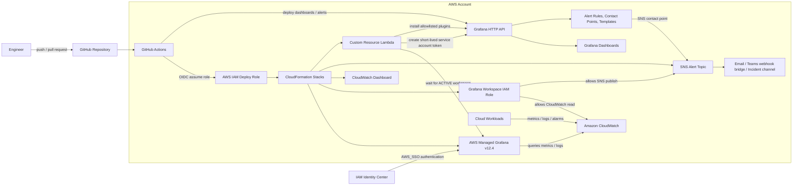

# AWS Managed Grafana Observability Platform

Runnable single-account AWS observability platform using **AWS Managed Grafana**, **CloudWatch**, **SNS**, **CloudFormation**, and **GitHub Actions**.

The project is designed for the Grafana Engineer assessment:

- Provision AWS Managed Grafana with IAM Identity Center SSO.
- Enable plugin administration and install approved plugins through a CloudFormation custom resource.
- Build a CloudWatch observability baseline.
- Deploy CloudWatch and Grafana dashboards.
- Create Grafana-managed alerts that notify an SNS topic through notification templates.
- Automate dashboard and alert deployment from GitHub Actions after the platform stack is created.

## What This Deploys

- **AWS Managed Grafana workspace** using IAM Identity Center authentication.
- **Customer-managed Grafana workspace IAM role** with CloudWatch read access and SNS publish access.
- **CloudWatch data source** in Grafana.
- **Native CloudWatch dashboard** for account-level visibility.
- **Grafana dashboards** for platform and workload health.
- **Grafana alerting assets**: SNS contact point, notification templates, notification policies, and alert rule group.
- **SNS topic** for alert delivery.
- **Plugin installer custom resource** backed by Lambda for approved Grafana plugins.
- **GitHub Actions pipeline** that validates, deploys, waits for the workspace, applies Grafana assets, and runs smoke tests.

## Architecture



Mermaid source is also available in [docs/diagrams/architecture.mmd](docs/diagrams/architecture.mmd).

## Implementation Scope

| Assessment item | Proposed implementation |
| --- | --- |
| AWS Managed Grafana via code | `AWS::Grafana::Workspace` in CloudFormation with `AuthenticationProviders: [AWS_SSO]`, `PermissionType: CUSTOMER_MANAGED`, and a dedicated workspace IAM role. |
| SSO integration | IAM Identity Center must be enabled before deployment. CloudFormation enables the workspace authentication provider; user/group assignment is handled as a bootstrap step or through an identity automation script. |
| Install basic plugins via code | CloudFormation custom resource invokes Lambda. Lambda enables a controlled plugin installation flow by calling Grafana's plugin API for an allowlist. |
| CloudWatch observability | CloudWatch data source, native CloudWatch dashboard, metric widgets, log query examples, and optional Container Insights/EKS metrics. |
| Custom dashboard for collected metrics | `AWS::CloudWatch::Dashboard` for native AWS view plus Grafana JSON dashboards for operator views. |
| Grafana alerts to SNS | Grafana Alerting provisioning API creates contact point type `sns`, notification templates, policy tree, and alert rule groups. |
| Automatic dashboard/alert deployment | GitHub Actions deploys CloudFormation first, reads stack outputs, mints a short-lived Grafana service account token, and applies dashboard/alert JSON. |

## Repository Structure

The repository separates AWS infrastructure, Grafana content, automation scripts, and operational documentation.

Detailed ownership notes are in [docs/file-structure.md](docs/file-structure.md).

```text
.
|-- README.md
|-- screenshot.md
|-- docs/
|   |-- architecture.md
|   |-- assessment-checklist.md
|   |-- deployment-guide.md
|   |-- file-structure.md
|   |-- diagrams/
|   |   `-- architecture.mmd
|   `-- runbooks/
|       `-- alert-response.md
|-- infra/
|   |-- README.md
|   |-- main.yaml
|   |-- parameters/
|   |   `-- dev.json
|   `-- custom-resources/
|       `-- plugin-installer/
|           |-- app.py
|           `-- requirements.txt
|-- grafana/
|   |-- README.md
|   |-- dashboards/
|   |   |-- cloudwatch-account-overview.json
|   |   `-- workload-health.json
|   |-- alerts/
|   |   |-- contact-points.json
|   |   |-- notification-policies.json
|   |   |-- notification-templates.json
|   |   `-- rule-groups.json
|   `-- provisioning/
|       |-- folders.json
|       `-- datasources.json
|-- scripts/
|   |-- README.md
|   |-- deploy-grafana-assets.py
|   |-- ensure-service-account-token.sh
|   |-- smoke-test.py
|   `-- validate-json.sh
|-- screenshots/
|   |-- screenshots.md
|   |-- pipeline builds successfully.png
|   |-- cloudformation_stack_completed.png
|   |-- dashboard_grafana.png
|   |-- workload health.png
|   |-- contact point.png
|   |-- notification policies.png
|   `-- sns_subscription confirmed.png
`-- .github/
    `-- workflows/
        |-- README.md
        |-- deploy-observability.yml
        `-- smoke-test.yml
```

## Deployment Flow

1. **Prepare AWS account**
   - Enable IAM Identity Center in the AWS account/region used for the assessment.
   - Create or identify admin/editor/viewer groups for Grafana access.
   - Create a GitHub OIDC deploy role with CloudFormation, IAM, Grafana, Lambda, CloudWatch, SNS, and Logs permissions scoped to this project.

2. **Deploy platform stack**
   - CloudFormation creates the workspace IAM role, SNS topic, CloudWatch dashboard, AWS Managed Grafana workspace, and plugin custom resource.
   - The Grafana workspace uses `PluginAdminEnabled: true`.
   - The custom resource installs only plugins listed in the approved parameter, for example CloudWatch core support plus optional Athena or JSON API plugins if allowed by the assessment.

3. **Bootstrap access**
   - Assign IAM Identity Center users/groups to the Grafana workspace.
   - Confirm the workspace reaches `ACTIVE`.
   - Generate a short-lived service account token for automation, or let the GitHub workflow create one at runtime through the AWS Managed Grafana API.

4. **Deploy Grafana assets**
   - GitHub Actions reads CloudFormation outputs such as `WorkspaceId`, `WorkspaceEndpoint`, and `SnsTopicArn`.
   - The pipeline applies folders, CloudWatch data source configuration, dashboards, contact points, notification templates, notification policies, and alert rule groups.

5. **Validate**
   - Confirm the CloudWatch data source can query metrics.
   - Confirm dashboards render metric panels.
   - Trigger or test the SNS contact point.
   - Confirm alerts include labels, severity, runbook URL, and templated message content.
   - Run `scripts/smoke-test.py --stack-name "$STACK_NAME" --region "$AWS_REGION" --token "$GRAFANA_TOKEN" --require-grafana-assets`.

Detailed commands are in [docs/deployment-guide.md](docs/deployment-guide.md).

## Verified Deployment Evidence

The project has a screenshot evidence index at [screenshot.md](screenshot.md), with the detailed gallery in [screenshots/screenshots.md](screenshots/screenshots.md).

Captured evidence covers:

- Successful GitHub Actions deployment.
- CloudFormation stack creation and completion.
- Amazon Managed Grafana workspace availability.
- Grafana dashboards in the `Platform Observability` folder.
- Grafana alert rule, notification policy, and SNS contact point.
- Native CloudWatch dashboard.
- SNS topic and confirmed subscription.

## Quick Start

Prerequisites:

- IAM Identity Center enabled in the AWS account/region.
- AWS CLI v2 configured locally, or GitHub Actions OIDC role configured in `vars.AWS_ROLE_ARN`, `vars.aws_role_arn`, or `secrets.AWS_ROLE_ARN`.
- A Grafana version available in the selected region. Confirm with `aws grafana list-versions --region us-east-1`.

GitHub repository variables:

```text
AWS_REGION=us-east-1
STACK_NAME=solvex-observability
PARAMETER_FILE=infra/parameters/dev.json
AWS_ROLE_ARN=arn:aws:iam::<account-id>:role/<github-actions-deploy-role>
```

The workflow also accepts `aws_role_arn` as the variable name, or `AWS_ROLE_ARN` as a repository secret.

Validate local assets:

```bash
scripts/validate-json.sh .
python3 -B -m py_compile scripts/deploy-grafana-assets.py scripts/smoke-test.py infra/custom-resources/plugin-installer/app.py
```

Deploy CloudFormation locally:

```bash
PARAMETER_OVERRIDES="$(
  python3 -c 'import json,sys; d=json.load(open(sys.argv[1])); print(" ".join(f"{k}={v}" for k,v in d.items()))' infra/parameters/dev.json
)"

aws cloudformation deploy \
  --stack-name solvex-observability \
  --template-file infra/main.yaml \
  --parameter-overrides $PARAMETER_OVERRIDES \
  --capabilities CAPABILITY_NAMED_IAM \
  --region us-east-1
```

Deploy Grafana assets after the stack is complete:

```bash
WORKSPACE_ID="$(aws cloudformation describe-stacks --stack-name solvex-observability --region us-east-1 --query "Stacks[0].Outputs[?OutputKey=='WorkspaceId'].OutputValue" --output text)"
GRAFANA_ENDPOINT="$(aws cloudformation describe-stacks --stack-name solvex-observability --region us-east-1 --query "Stacks[0].Outputs[?OutputKey=='WorkspaceEndpoint'].OutputValue" --output text)"
SNS_TOPIC_ARN="$(aws cloudformation describe-stacks --stack-name solvex-observability --region us-east-1 --query "Stacks[0].Outputs[?OutputKey=='SnsTopicArn'].OutputValue" --output text)"

GRAFANA_TOKEN="$(scripts/ensure-service-account-token.sh --workspace-id "$WORKSPACE_ID" --region us-east-1)"

scripts/deploy-grafana-assets.py \
  --endpoint "$GRAFANA_ENDPOINT" \
  --token "$GRAFANA_TOKEN" \
  --region us-east-1 \
  --sns-topic-arn "$SNS_TOPIC_ARN" \
  --environment dev
```

Run smoke tests:

```bash
scripts/smoke-test.py \
  --stack-name solvex-observability \
  --region us-east-1 \
  --token "$GRAFANA_TOKEN" \
  --require-grafana-assets
```

## CloudFormation Design

Use a customer-managed permission model so the assessment reviewer can see every permission explicitly.

Core resources:

- `AWS::IAM::Role` for the Managed Grafana workspace.
- `AWS::Grafana::Workspace` with:
  - `AccountAccessType: CURRENT_ACCOUNT`
  - `AuthenticationProviders: [AWS_SSO]`
  - `PermissionType: CUSTOMER_MANAGED`
  - `PluginAdminEnabled: true`
  - `RoleArn` pointing to the workspace role
  - `NotificationDestinations: [SNS]` when using Grafana-to-SNS notifications
- `AWS::SNS::Topic` for alert notifications.
- `AWS::CloudWatch::Dashboard` for the native AWS dashboard.
- `AWS::Lambda::Function` plus `Custom::GrafanaPlugins` for plugin installation.

Attach the AWS managed policy `arn:aws:iam::aws:policy/service-role/AmazonGrafanaCloudWatchAccess` to the workspace role for CloudWatch reads, then add least-privilege `sns:Publish` to the alert topic.

## Grafana Asset Deployment

Recommended API sequence:

1. Create or update folders.
2. Create or update the CloudWatch data source.
3. Create or update dashboards.
4. Create or update notification template groups.
5. Create or update SNS contact points.
6. Replace notification policy tree.
7. Create or update alert rule groups.

Grafana Alerting APIs to use:

- `PUT /api/v1/provisioning/templates/:name`
- `POST /api/v1/provisioning/contact-points`
- `PUT /api/v1/provisioning/contact-points/:uid`
- `PUT /api/v1/provisioning/policies`
- `PUT /api/v1/provisioning/folder/:folderUid/rule-groups/:group`

For dashboards, this project uses `POST /api/dashboards/db` because it remains supported in Grafana v12 and is compatible with AWS Managed Grafana.

## GitHub Actions Strategy

The deployment workflow uses three jobs:

- `validate`: validates Grafana JSON and CloudFormation syntax.
- `deploy-platform`: validates and deploys CloudFormation.
- `deploy-grafana-assets`: runs only after the platform is active and deploys dashboards/alerts.

Use GitHub OIDC instead of static AWS keys. The workflow should:

1. Configure AWS credentials by assuming the deploy role.
2. Run template validation.
3. Deploy the CloudFormation stack.
4. Read stack outputs.
5. Create a short-lived service account token.
6. Apply Grafana assets through the HTTP APIs.
7. Run smoke checks against the workspace endpoint.

## Alerting Model

Starter alert rules:

- `cloudwatch-high-error-rate`: Lambda or application error count above threshold.
- `cloudwatch-high-5xx-rate`: ALB/API Gateway 5xx rate above threshold.
- `cloudwatch-high-latency`: p95 latency above threshold.
- `cloudwatch-missing-metrics`: no data from expected workload namespace.
- `cloudwatch-cost-cardinality-watch`: unusual metric volume or high cardinality indicator.

Each alert should include:

- `severity`
- `service`
- `environment`
- `team`
- `runbook_url`
- `dashboard_url`
- concise summary and impact annotation

SNS notification templates should include firing/resolved status, service, severity, owning team, direct dashboard link, and runbook link.

## Operational Runbooks

Start with [docs/runbooks/alert-response.md](docs/runbooks/alert-response.md). Extend it with one runbook per alert group as the implementation grows.

Minimum runbook content:

- What the alert means.
- Customer or platform impact.
- First checks in Grafana and CloudWatch.
- AWS CLI commands for verification.
- Escalation path.
- Rollback or mitigation steps.

## Security Notes

- Do not commit Grafana tokens, AWS keys, SSO metadata, or SNS subscription endpoints.
- Prefer short-lived Grafana service account tokens generated at deploy time.
- Restrict plugin installation to an allowlist.
- Scope the GitHub OIDC role to the repository, branch, and environment.
- Use customer-managed IAM for reviewability.
- Add CloudTrail/audit log checks for workspace updates in production.

## Cleanup

Recommended teardown sequence:

1. Disable or remove Grafana alert rules to stop notifications.
2. Delete Grafana service account tokens.
3. Delete the CloudFormation stack.
4. Confirm SNS subscriptions and CloudWatch dashboards are removed.
5. Remove IAM Identity Center assignments if they were created for the assessment only.

## References

- [AWS::Grafana::Workspace CloudFormation reference](https://docs.aws.amazon.com/AWSCloudFormation/latest/TemplateReference/aws-resource-grafana-workspace.html)
- [AWS::CloudWatch::Dashboard CloudFormation reference](https://docs.aws.amazon.com/AWSCloudFormation/latest/TemplateReference/aws-resource-cloudwatch-dashboard.html)
- [Amazon Managed Grafana plugin API](https://docs.aws.amazon.com/grafana/latest/userguide/v10-Grafana-API-Plugin.html)
- [Amazon Managed Grafana service accounts](https://docs.aws.amazon.com/grafana/latest/userguide/v10-service-accounts.html)
- [Grafana Alerting provisioning API](https://grafana.com/docs/grafana/latest/developer-resources/api-reference/http-api/api-legacy/alerting_provisioning/)
- [AmazonGrafanaCloudWatchAccess managed policy](https://docs.aws.amazon.com/aws-managed-policy/latest/reference/AmazonGrafanaCloudWatchAccess.html)
