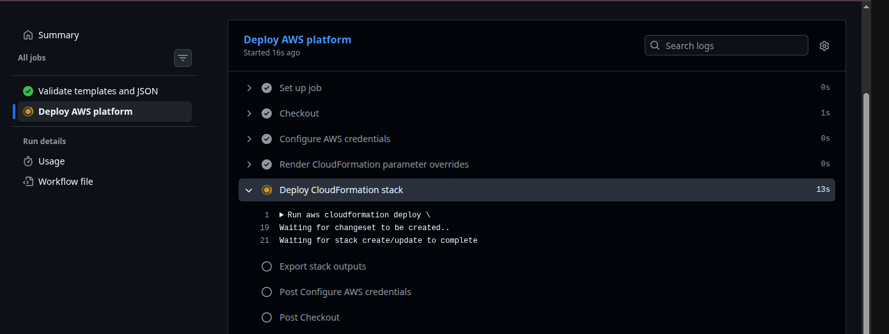
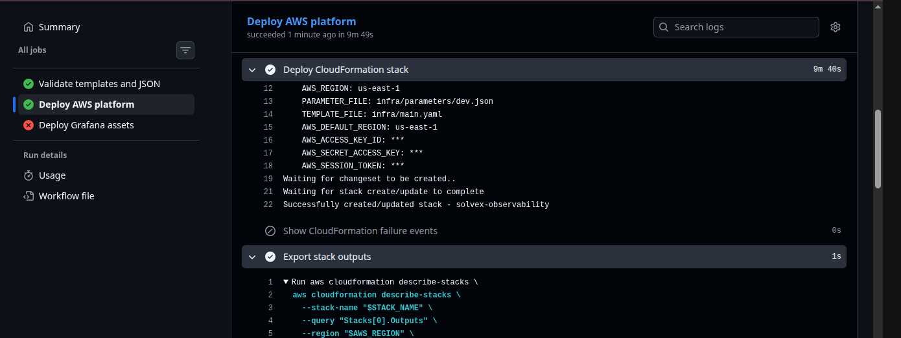
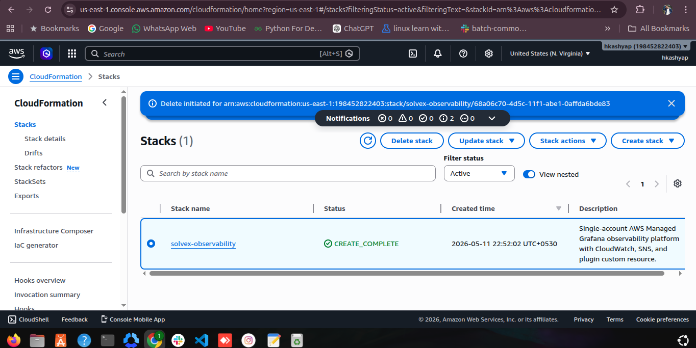
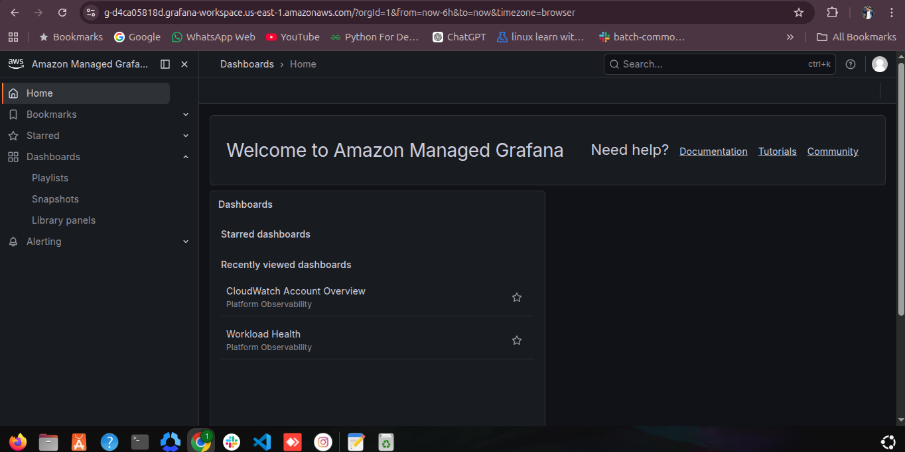
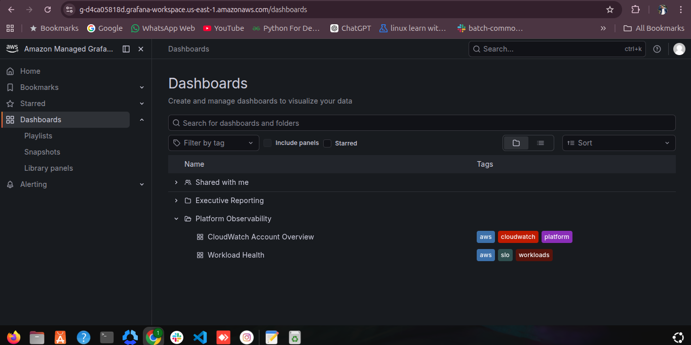

# Screenshots

Screenshot gallery for the AWS Managed Grafana observability platform.

Root evidence index: [../screenshot.md](../screenshot.md)

## CI/CD

## CloudFormation

## Amazon Managed Grafana

## Grafana Dashboards

## Grafana Alerting

## AWS Notifications

## Access

